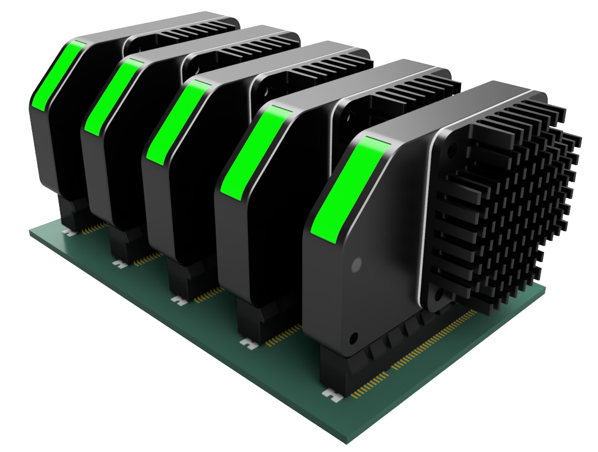

# RADIX - MODULAR DRIVER SYSTEM FOR HIGH POWER MOTORS WITH CLOSED-LOOP SUPPORT

The RadiX Drive is a high-performance, quad/six-channel PWM driver capable of delivering up to 450/1500W of power. Its design is optimized for controlling inductive and resistive loads, making it ideal for a variety of motor types as well as solenoids and transformers. The driver's "bare metal" architecture excludes unnecessary components, which reduces its cost, physical size, and heat output while enabling customization for specific applications. The use of a single board-to-board connector and a unified module design streamlines the integration process by cutting down on wiring complexity and ensuring stable electrical connections. The RadiX Drive supports a wide array of interfaces and encoders, enhancing its versatility across different applications. It is compatible with DC, BLDC, PMSM, and Stepper motors.

## Key Features

- 🧩 **Modular Concept:** Offers single board for various configurations for different cost, size and performance needs
- 🕹️ **Closed-Loop Control:** enables an encoder support for real-time position monitoring, ensuring precise and safe motion.
- ⚡ **Powerfull and effective control capabilites:** Capable of up to 8/10ARMS per channel with operational voltage 3-75V and a maximum of 30mΩ total phase resistance
- 💵 **Economical:** Keeps the cost remarkably low without compromising on quality or functionality.

## Applications

- 🏭 Industrial Motion Control Systems
- 🎓 Learning Platforms
- 🛠️ CNC Machines & 3D printers
- 🤖 Robotics & Automation Systems
- 🤝 Collaborative Robots
- 🔬 Laboratory Equipment

## Repository Structure

- **[`wiki`](wiki)**: includes design documentation and other information

## Hardware Versions

#### RadiX Drive x8

- **`R1.0`** [in design]: compact STEPPER and BLDC driver [[wiki]](./wiki/RadiX-Drive/R1.0/specification.md)

  > - **Key info:** 4 channels 3-75V 8ARMS/Channel 450WMAX, PCIe x8, 64x49x10mm
  > - **Supported interfaces:** STEP-DIR-EN, USB, CAN-FD, USART, I2C, SPI, ABZ

#### RadiX Drive x16

- **`R1.0`** [in design]: compact dual BLDC driver

	> - **Key info:** 6 channels 3-75V 10ARMS/Channel 1500WMAX, PCIe x16, 100x49x10mm
	> - **Supported interfaces:** STEP-DIR-EN, USB, CAN-FD, USART, I2C, SPI, ABZ

## Hardware Development Roadmap

- **[April 2024]** - RadiX Drive x8 + development board testing
- **[May 2024]** - RadiX Drive x16 + development board testing

***Important Note:** If critical problems will be revealed, the schedule will be updated*

## Supporting the Project

If this project resonates with you, please consider the following ways to support its development:

- **[Ko-fi](https://ko-fi.com/creapunk):** Preferred for membership subscription and one-time donation
- **[Patreon](https://patreon.com/creapunk):** Alternative platform with higher fees
- **Join [Discord community](https://discord.gg/V4aJdTja8v):** Stay updated, engage in discussions, and contribute to the project

**Your contribution, regardless of size, is greatly appreciated!** 

---

***Important Note:** This README will be updated to reflect the latest progress and changes in the project*.

